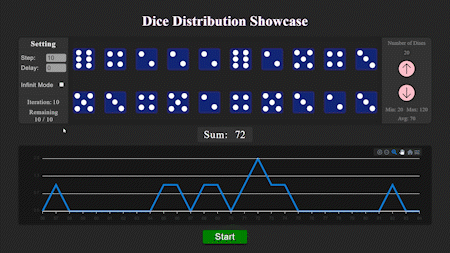

<h1>React-Dice-Distribution</h1>

    

<h2>Overview</h2>

    React-Dice-Distribution is a visually appealing web application built with
    React that showcases dice distribution in a graphical form. The app includes
    a control panel where users can manipulate the number of dice (ranging from
    2 to 30), the delay between each dice deployment, and the number of times
    the dice are thrown in a single step. The user can set these parameters and
    initiate the dice rolling process by clicking the "Start" button. The sums
    of the dice numbers are then displayed on a responsive chart.

    The chart, implemented using the ApexCharts library, provides an immersive
    experience with features such as zoom, responsiveness, smooth animations,
    and transitions. Additionally, the chart offers export options, allowing
    users to save it in SVG, PNG, or CSV formats.

    The application's meticulous attention to detail and high level of
    craftsmanship is evident. It has been designed to ensure a seamless user
    experience on devices of varying sizes, thanks to a custom responsive design
    that includes scaling and rotation capabilities. You can access the app on
    GitHub Pages using the following link:
    <a href="https://ali-sdg90.github.io/React-Dice-Distribution/" target="_new"
        >React-Dice-Distribution</a
    >.

    The chart visualizes the data in a line format, displaying the line of all
    accumulated dice sums. This representation facilitates the identification of
    a normal distribution or bell curve. The dark theme employed in the app
    contributes to enhanced readability and reduced eye strain.

<h2>Features</h2>
<ul>
    <li>
        Dynamic control panel allowing the adjustment of:
        <ul>
            <li>Number of dice (2 to 30)</li>
            <li>Delay between dice deployments</li>
            <li>Number of times dice are thrown in a step</li>
            <li>Infinite Mode: Continuously rolling the dice</li>
        </ul>
    </li>
    <li>
        Responsive chart with the following capabilities:
        <ul>
            <li>Zooming functionality</li>
            <li>Exporting the chart in SVG, PNG, or CSV formats</li>
            <li>Smooth animations and transitions</li>
        </ul>
    </li>
    <li>
        Custom responsive design ensuring optimal user experience across
        different devices
    </li>
    <li>Dark theme for improved visual comfort</li>
</ul>

<h2>Installation</h2>

    To run React-Dice-Distribution locally on your machine, follow these steps:

<ol>
    <li>Clone the repository:</li>
</ol>

<pre><code>git clone https://github.com/ali-sdg90/React-Dice-Distribution.git
</code></pre>
<ol start="2">
    <li>Navigate to the project directory:</li>
</ol>
<pre><code>cd React-Dice-Distribution
</code></pre>
<ol start="3">
    <li>Install the dependencies:</li>
</ol>
<pre><code>npm install</code></pre>
<ol start="4">
    <li>Start the development server:</li>
</ol>
<pre> <code>npm start</code></pre>
<ol start="5">
    <li>
        Open your web browser and visit
        <code>http://localhost:3000</code> to access the application.
    </li>
</ol>
<h2>Usage</h2>
<ol>
    <li>
        Upon opening the application, you will be presented with the control
        panel.
    </li>
    <li>
        Adjust the desired parameters:
        <ul>
            <li>Number of dice: Choose a value between 2 and 30.</li>
            <li>Delay: Define the duration between each dice deployment.</li>
            <li>
                Steps: Set the number of times the dice are thrown in a single
                step.
            </li>
            <li>
                Infinite Mode: Check this box to continuously roll the dice.
            </li>
        </ul>
    </li>
    <li>Click the "Start" button to initiate the dice rolling process.</li>
    <li>
        Observe the chart as it dynamically updates with the sum of the dice
        numbers.
    </li>
    <li>
        Use the chart's zoom functionality, and export the chart in SVG, PNG, or
        CSV formats, as needed.
    </li>
    <li>
        Enjoy exploring the fascinating normal distribution or bell curve
        visualization provided by the chart.
    </li>
</ol>
<h2>Technologies Used</h2>
<ul>
    <li>React</li>
    <li>ApexCharts</li>
    <li>CSS</li>
</ul>
<h2>Contribution</h2>

    Contributions to React-Dice-Distribution are welcome! If you would like to
    contribute to the project, please follow these guidelines:

<ol>
    <li>Fork the repository.</li>
    <li>Create a new branch for your feature or bug fix.</li>
    <li>Make your changes and ensure that the code is properly formatted.</li>
    <li>Write appropriate tests for your changes, if applicable.</li>
    <li>Commit your changes with clear and descriptive commit messages.</li>
    <li>Push your changes to your forked repository.</li>
    <li>
        Submit a pull request to the main repository, providing a detailed
        description of your changes.
    </li>
</ol>

    Please note that all contributions are subject to review. To ensure a smooth
    review process, consider the following:

<ul>
    <li>Follow the coding style and conventions used in the project.</li>
    <li>Keep your changes focused and avoid making unrelated modifications.</li>
    <li>
        Write clear and concise documentation when introducing new features or
        modifying existing ones.
    </li>
    <li>
        Ensure that all existing tests pass and write new tests to cover the
        changes you made.
    </li>
</ul>

    By contributing to React-Dice-Distribution, you agree that your
    contributions will be licensed under the
    <a
        href="https://github.com/ali-sdg90/React-Dice-Distribution/blob/main/LICENSE"
        target="_new"
        >MIT License</a
    >.

    Thank you for considering contributing to this project. Your help is greatly
    appreciated!

<h2>License</h2>

    This project is licensed under the
    <a
        href="https://github.com/ali-sdg90/React-Dice-Distribution/blob/main/LICENSE"
        target="_new"
        >MIT License</a
    >.

